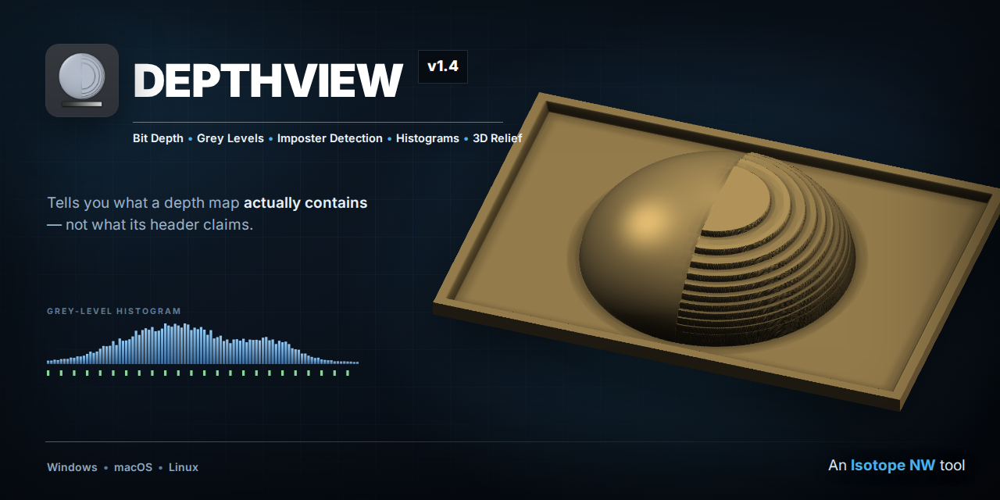
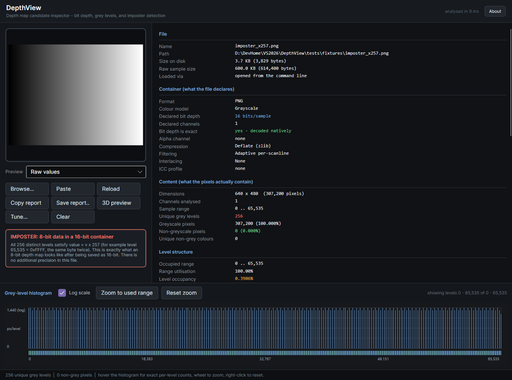
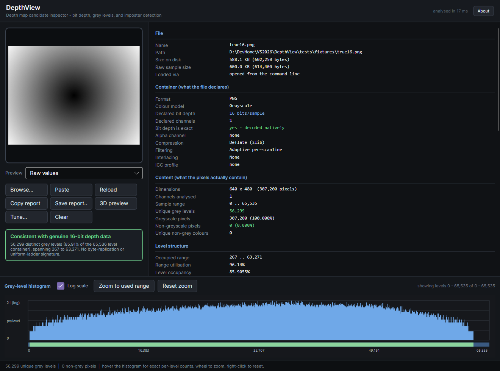
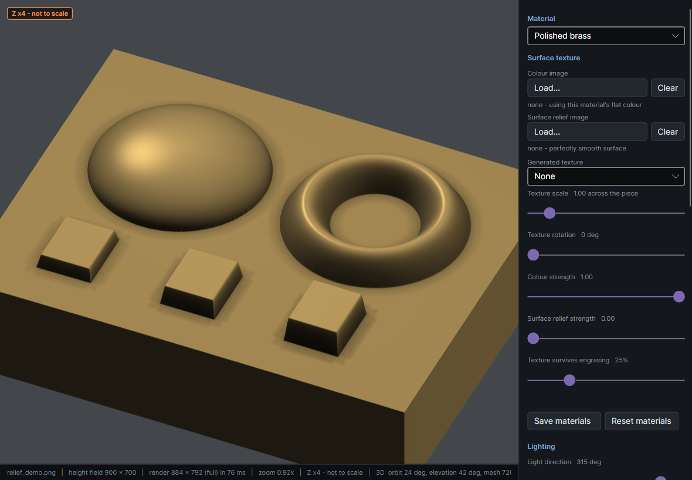
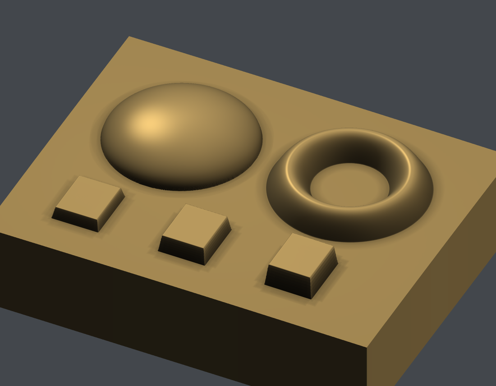
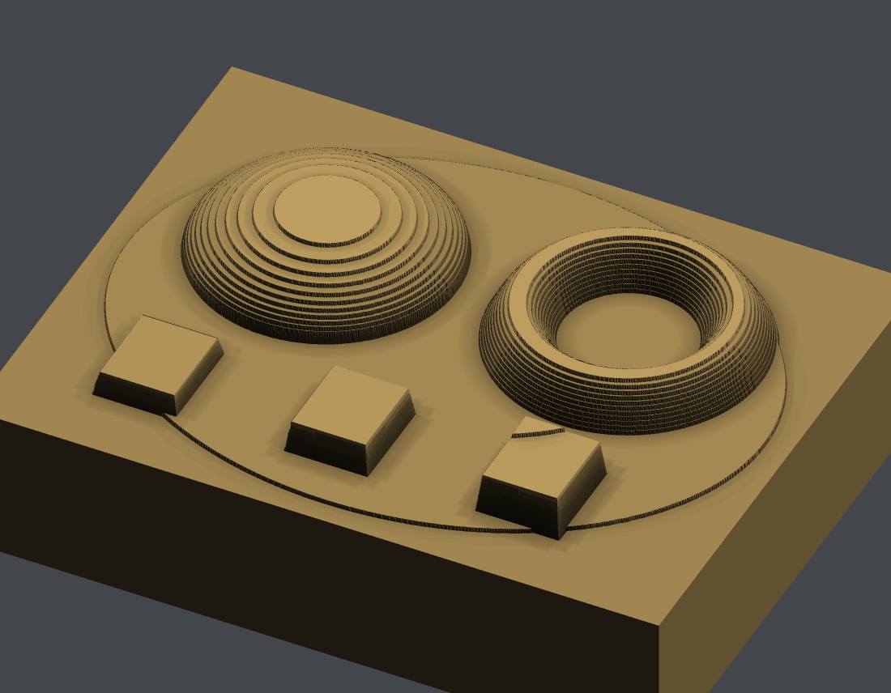
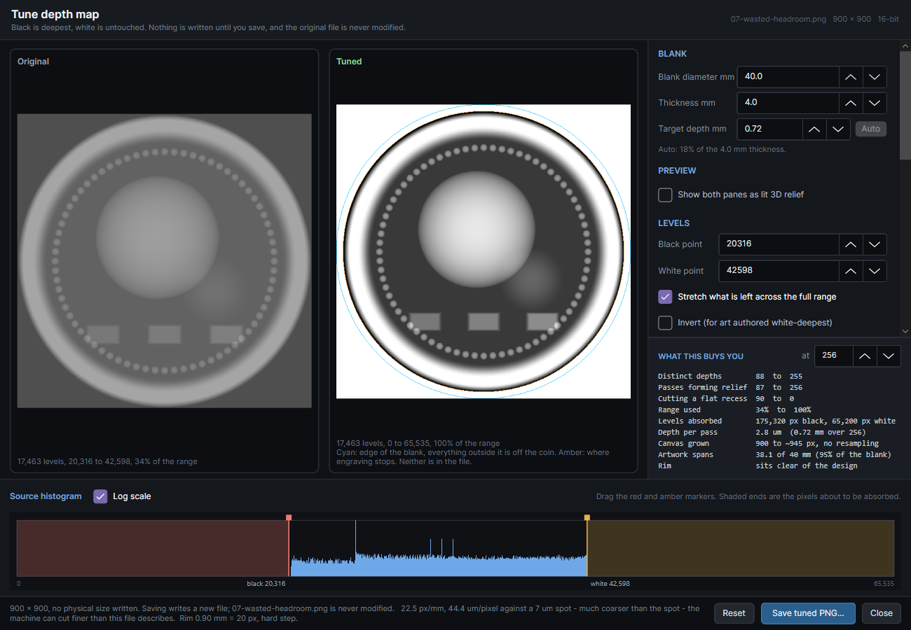
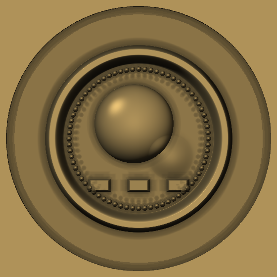
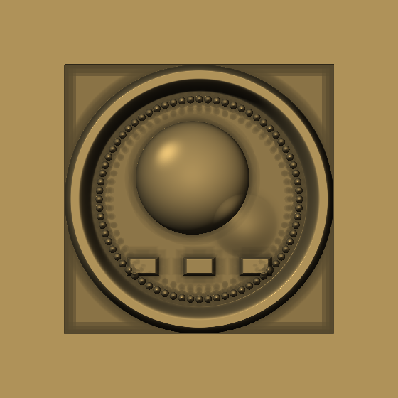
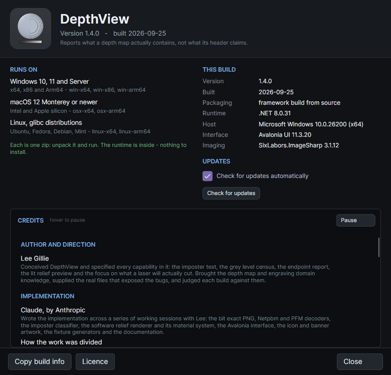

# DepthView



[](https://github.com/LeeGillie/DepthView/actions/workflows/build.yml)
[](LICENSE)

A depth-map candidate inspector. Feed it an image and it tells you what the file
*claims* to be, what its pixels *actually* contain, and whether those two things
agree.

Built for one specific frustration: a 16-bit PNG that only carries 8 bits of real
depth information. DepthView calls those **imposters** and names the exact
mechanism behind each one.



*A file that declares 16 bits per sample and contains 256 distinct levels. The evenly spaced
teeth across the whole histogram are the giveaway — every level lands on a multiple of 257,
because an 8-bit map was saved as 16-bit by copying each byte twice.*

---

## Why this exists

Depth maps lie, and nothing in the normal toolchain tells you.

An image viewer shows you a smooth grey ramp. Photoshop reports "16 bits/channel." Your laser
software accepts the file without comment. All of them are reading the *header*. None of them
count what is actually in the pixels — and a 16-bit file carrying 8 bits of real data looks
identical to a genuine one until it is on the workpiece and the relief comes out terraced.

DepthView answers the question the header can't: **how much depth information is really in
this file, and what will it look like when a laser turns it into layers?**

---

## If you use LightBurn

LightBurn 2.1's [3D Sliced Image mode](https://docs.lightburnsoftware.com/2.1/Guides/3DSlicedImage/)
is a genuinely good way to cut relief on a galvo. It also accepts your depth map without
judgement, and that is where DepthView earns its place.

> ### Version matters here
>
> The galvo 3D Slice path was **internally 8-bit before LightBurn 2.1**, and 2.1 added
> 16-bit support. From the [current documentation](https://docs.lightburnsoftware.com/2.1/Guides/3DSlicedImage/):
>
> > *"As of LightBurn 2.1, LightBurn support 16 bit depth maps."*
> > *"If you plan to run more than 256 passes, a 16 bit image is better, as it can contain
> > more than 256 shades of gray."*
>
> So on 2.1 and later a genuine 16-bit map does buy you depth resolution, above 256 passes.
> On earlier versions it does not. This README briefly claimed a flat 256-level ceiling for
> all versions, which was wrong — thanks to
> [Nathaniel Klumb](https://forum.lightburnsoftware.com/t/depth-maps-that-claim-16-bit-and-arent-how-to-spot-them-before-you-slice/192202)
> for the correction.
>
> Because no single ceiling is right for everyone, DepthView does not assume one. It reports
> **how many distinct depths your file resolves at a given pass count**, which is true on any
> version and any toolchain.

Two real files, from `--report`:

```
   passes  depths  uniform  relief  empty     passes  depths  uniform  relief  empty
       64      22       22      22     20         64      64        0      64      0
      256      88       90      87     79        256     255        0     256      0
     1024     347      358     349    317       1024   1,014        0   1,024      0

     a 16-bit map using a third        a 16-bit map using its
     of its range: 17,463 levels       full range: 7,814 levels
```

The left file holds **more than twice** the grey levels and resolves **a third as many
depths** at every pass count, because its levels sit in the middle third of the range. Its
design also ends up in a recess: at 256 passes, 90 of them cut every engraved pixel equally.
That may be exactly what was wanted — the point is that you cannot see any of it by looking
at the image or the header.

| What LightBurn does | What it doesn't tell you | What DepthView adds |
|---|---|---|
| Accepts 8-bit **and** (since 2.1) 16-bit greyscale | Whether your 16-bit file *contains* 16 bits | Names the imposter and its mechanism, before you burn a blank |
| Treats a 24-bit image as 8-bit — its docs say a 24-bit depth map "is actually three 8-bit channels" | That your greyscale map was saved as RGB and just lost its precision | Flags *grey data stored as RGB* as its own finding |
| **Number of Passes** is the slice count | How many distinct depths you actually get at that pass count | The pass-count table above, and what each pass is doing |
| Slices whatever range the image occupies | That a map spanning 267–63,271 leaves passes cutting a flat recess at one end and empty at the other | Splits the passes into relief, uniform and empty, and leaves the judgement to you |
| Accepts colour images | That stray non-grey pixels are in there at all | Flags them, and shows them as a red mask |

The short version: LightBurn decides *how* to cut. DepthView tells you whether the file you
are about to hand it can fill the passes you were planning to run.

---

## If you run a WeCreat Lumos Ultra

WeCreat's own product page for the Lumos Ultra says its relief engraving "maps your design
into **256 depth layers**." That single number reframes the whole question, and it cuts both
ways depending on which software you drive the machine with.

> **What that number actually is.** WeCreat's support team have confirmed that the 256-layer
> figure is an **8-bit software representation, not a controller limit** — it describes what
> the toolchain carries, not what the machine is capable of — so the ceiling moves when the
> software does. LightBurn 2.1 is an example of exactly that: its galvo path was 8-bit and
> now takes 16-bit depth maps.

**Through MakeIt** — 256 layers is the ceiling. A 16-bit depth map is over-spec for that path,
so "is my file really 16-bit?" is the wrong question. The right one is *do my 256 levels land
well* — are they evenly distributed, do they reach both ends of the range, is the shadow
detail clipped? DepthView reports exactly that: level occupancy, range utilisation, endpoint
counts, and how much of the depth budget goes unused.

**Through LightBurn 2.1 or later** — the Lumos Ultra is listed as supporting both MakeIt and
LightBurn, and 3D Slice is galvo-only, which a MOPA Lumos Ultra is. This is the path where a
genuine 16-bit map earns its keep: LightBurn's docs recommend 16-bit specifically for runs
past 256 passes, and a real 16-bit file keeps resolving new depths well beyond that, while an
imposter stops dead at 256 no matter how many passes you run. That is the case DepthView was
built for, and the pass-count table above is how you tell the two apart before you cut.

Either way, the practical workflow is the same. AI and relief generators (Sculptok and
friends) emit 16-bit PNGs by default whether or not the content justifies it. Point DepthView
at the folder:

```
DepthView --report ./depthmaps --summary
```

```
OK    16bit  56,299 levels  step 1     coin-front.png
FAIL  16bit     256 levels  step 257   coin-back.png
FAIL  16bit   1,024 levels  step 64    logo-relief.png
```

Exit code 1 when anything is flagged, so it drops into a batch script. Screen the folder
before you spend brass.

---

## What you can't easily get elsewhere

Some of these numbers exist in general-purpose tools if you go looking. ImageMagick will count
unique colours; GIMP will draw a 16-bit histogram. What none of them do is interpret any of it
*as a depth map bound for a laser*.

- **Bit-exact 16-bit reading, guaranteed.** Windows WIC, macOS CoreGraphics, GTK and browser
  canvas all quietly hand back an 8-bit buffer for a 16-bit PNG. A viewer showing you a
  "16-bit" image has usually already destroyed the evidence. DepthView decodes PNG, PGM/PPM/PBM
  and PFM itself, byte by byte, and flags any format where it cannot make that promise.
- **The mechanism, not just the symptom.** "256 unique colours" is a number. "Every level is
  v × 257, so an 8-bit map was byte-replicated into 16 bits" tells you what happened and where
  to go fix it. DepthView separates ×257 replication, ×256 shifting, uniform quantisation
  ladders, and merely sparse data.
- **Catches 10-bit and 12-bit hiding in 16-bit too.** The check is the GCD of the gaps between
  used levels, not a hardcoded 256 test, so a 1,024-level map on a step of 64 is caught the
  same way.
- **Colour contamination in a "greyscale" map.** Counts pixels where R, G and B are not all
  equal, and how many distinct non-grey colours occur. A handful means JPEG chroma damage;
  thousands means somebody handed you a turbo-colourmapped preview instead of a depth map.
- **Terracing you can see before you cut it.** The relief preview quantises to your pass count
  and renders the staircase in 3D, on brass or steel or wood.
- **Endpoints in laser terms.** Pure white is zero passes and bare surface; pure black is full
  depth. Both counts are reported, and when a map reaches neither, DepthView names the
  lightest and darkest levels that *do* occur and how many levels are wasted at each end.
- **Built to be run in bulk.** Full text reports, one-line summaries, folder scanning and
  meaningful exit codes, from an executable with nothing to install.

---

## What it reports



*The same panel on a genuine 16-bit depth map: 56,299 distinct levels, a step of 1, and a
histogram with no comb in it. This is what you want to see.*

**Container** (from the file header)
format, colour model, declared bit depth, channels, palette size, alpha,
compression, filtering, interlacing, gamma, sBIT, ICC profile, resolution.

**Content** (from every pixel)

| Measurement | Why it matters |
|---|---|
| Unique grey levels | Distinct values where R = G = B. The real information content of the map. |
| Greyscale vs non-greyscale pixel counts | A depth map should be 100% neutral. Anything else is contamination. |
| Unique non-grey colours | A handful means compression artefacts. Thousands means it is a colour-encoded map, not a grey one. |
| Per-channel unique counts (R/G/B) | These match exactly in genuine greyscale-stored-as-RGB. |
| Full grey-level histogram | Hover for the exact level and pixel count under the cursor. |

**Endpoints and clipping**

| Measurement | Why it matters |
|---|---|
| Pure white pixel count | Pixels on the container maximum. In a laser workflow these get zero passes and are left as bare surface. A large flat count can also mean clipped highlights. |
| Pure black pixel count | Pixels on zero — full depth. A large flat count usually means clipped shadows, with relief detail past that depth already thrown away. |
| Lightest / darkest level present | When an endpoint has no pixels at all, DepthView reports how close the map actually got and with how many pixels, rather than just saying "none". |
| Unused headroom | Levels unoccupied at each end. Headroom at the top means passes whose mask is empty; headroom at the bottom means the design never reaches bare surface, so every pass cuts a uniform recess under it. Neither is automatically a fault — see the note on stretching below. |

**Level structure** — where imposters give themselves away

| Measurement | Reading it |
|---|---|
| Level step (GCD) | 1 = native data. **257** = byte replication. **256** = left shift. Anything else > 1 = quantised then stretched. |
| Uniform ladder | Every used level sits exactly on the same step. Real depth data essentially never does this. |
| Effective bits | log2 of the unique level count. The honest bit depth. |
| Level occupancy | Unique levels / container size. Exactly 0.3906% means 256 of 65,536. |
| Range utilisation | How much of the container's range is used at all. |
| Histogram gaps | A regular comb of gaps is the visual form of the level step. |

**Depths per pass count** — what the level structure is actually worth once a slicer has had it

| Measurement | Reading it |
|---|---|
| Depths | Distinct engraved levels you get at that pass count, limited by the passes you run and by the gradation in the file, whichever runs out first. |
| Uniform | Passes whose mask covers every engraved pixel. They cut, and they remove real material — but they deepen the whole design equally, so what they leave is a flat recess under it rather than any part of the picture. |
| Relief | Passes where the mask is shrinking. The only ones that carry shape. |
| Empty | Passes with nothing in the mask at all, because nothing in the map is dark enough to reach them. |
| Stretched | Depths you would get if the occupied levels were spread across the full range. See the note below — this is a decision about depth, not a repair. |
| **Band spread** | How many of the file's levels fall into each pass, narrowest to widest. See below — this is a separate cost from the depth count, and it is where thin precision shows even when the depth count looks fine. |

#### Stretching the range is a depth decision, not a repair

Worth being precise about, because an earlier version of this README was not, and was
[corrected on the LightBurn forum](https://forum.lightburnsoftware.com/t/depth-maps-that-claim-16-bit-and-arent-how-to-spot-them-before-you-slice/192202).

Take a map whose levels occupy 34% of the range. At 256 passes it resolves 88 depths, and
its relief occupies 87 of those passes — 1.01 levels per pass of relief depth, which is the
theoretical maximum. **Nothing is being wasted.** You cannot fit more levels into a relief
than you have passes of depth to put them in.

Stretching it to the full range gives 255 depths. It does that by making the relief roughly
three times deeper, and it gets more levels *because* it is deeper. Levels per unit of depth
are identical before and after.

So DepthView reports what the file currently asks for and what changing it would mean. It
does not call a narrow range a fault. If the shallowness was deliberate — someone wanting a
subtle relief — stretching overrides that intent by a factor of three. If it was an artefact
of the pipeline, which happens often enough (normalised exports, 8-bit maps widened into
16-bit containers), the extra depth is there for the taking. **Nothing in the file says
which**, and the tool does not pretend to know.

The same care applies to the pass split. A pass that adds no new level still fires and still
removes material; it deepens rather than shapes. That is why there is no column called
"wasted".

#### Band spread, and why 16 bits matter below 256 passes

A slicer cuts the level range into equal bands, one per pass. Levels are integers, so
unless the pass count divides the range exactly, some bands hold more levels than others.
Every pass still removes the same material — but on a smooth gradient the *terraces* come
out at uneven widths, in whatever ratio the arithmetic lands on.

At 200 passes, a 256-level map splits into 144 bands one level wide and 56 two levels wide:
a **2:1 spread**. A 65,536-level map splits into 327s and 328s: **0.3%**. Same absolute
error of one level, wildly different relative error.

Across every pass count from 2 to 256, only **eight** leave 8-bit precision evenly divided —
exactly the powers of two — while **127 of 255** produce a 2:1 spread. Nothing in that range
troubles a genuine 16-bit map at all; the worst case is 1.004.

So this is not a "more than 256 passes" concern. Unless you land on a power of two, thin
precision gives you irregular terrace spacing at almost any pass count, while the depth count
looks perfectly healthy.

It is measured against the ladder the file actually carries, not the container it declares,
which is the point here — an imposter inherits the 8-bit behaviour while looking 16-bit in
every file dialog:

```
genuine 16-bit                         8-bit ladder in a 16-bit container
passes  depths  relief  band spread    passes  depths  relief  band spread
   200     199     200  327..328 x1.00    200     199     200  1..2 x2.00
```

Identical depth counts. Raised by Nathaniel Klumb on the LightBurn forum; see
[ACKNOWLEDGEMENTS.md](ACKNOWLEDGEMENTS.md).

### Imposter classes detected

| Verdict | Signature |
|---|---|
| `Replicated257` | Every level is `v x 257` — an 8-bit map saved as 16-bit by byte replication. |
| `HighByteOnly` | Every level has a zero low byte (`v x 256`) — an 8-bit map left-shifted into 16 bits. |
| `QuantisedLadder` | Levels form a perfectly even ladder with step > 1 — catches 10-bit, 12-bit and any other depth hiding in a larger container, not just the 8-in-16 case. |
| `SparseLevels` | Far fewer levels than the container holds, with no clean pattern. Usually rescaled or filtered 8-bit source. |

---

## Running it

Nothing to install. The published binary is a single self-contained executable
with the .NET runtime inside it.

* **Windows** — double-click `DepthView.exe`
* **macOS** — `chmod +x DepthView && ./DepthView`
* **Linux** — `chmod +x DepthView && ./DepthView`

### Try it in sixty seconds

`samples/` holds eight depth maps, committed to the repository so there is nothing to
generate. They are **the same coin-style relief encoded eight different ways** — genuine
16-bit, two byte-widening imposters, a 10-bit ladder, grey stored as RGB, honest 8-bit,
wasted headroom, and colour contamination.

Drop them on DepthView in order. The picture is identical every time. The verdict is not.

```
DepthView --report samples --summary
```

```
OK      900x900   16bit  45,664 levels  step 1              0 non-grey  01-genuine-16bit.png
FAIL    900x900   16bit     255 levels  step 257            0 non-grey  02-imposter-x257.png
FAIL    900x900   16bit     255 levels  step 256            0 non-grey  03-imposter-high-byte.png
WARN    900x900   16bit   1,014 levels  step 64             0 non-grey  04-quantised-1024.png
OK      900x900    8bit     255 levels  step 1              0 non-grey  05-grey-stored-as-rgb.png
OK      900x900    8bit     255 levels  step 1              0 non-grey  06-honest-8bit.png
OK      900x900   16bit  17,463 levels  step 1              0 non-grey  07-wasted-headroom.png
OK      900x900    8bit     255 levels  step 1            897 non-grey  08-colour-contaminated.png
```

Rows 1, 2 and 6 are the argument in three lines: the imposter declares everything the
genuine file declares, and carries exactly what the honest 8-bit file carries.
[`samples/README.md`](samples/README.md) walks through what each one is for.

### Loading an image

Three ways, all equivalent:

* **Drag and drop** onto the panel at the left
* **Click** the panel to open a file browser
* **Ctrl+V** to paste

> **Clipboard warning.** If you copy the *file* in your file manager, DepthView
> reads the original bytes and the bit-depth reading is trustworthy. If you copy
> the *picture* out of a viewer, the OS clipboard has almost certainly already
> flattened it to 8 bits per channel. DepthView detects which path was used and
> warns you rather than reporting a wrong answer.

### Preview modes

| Mode | Use |
|---|---|
| Raw values | Samples scaled straight to screen. |
| Auto-stretch | min..max mapped to full black..white, so shallow depth ranges become visible. |
| **Low byte only** | Shows just the bottom 8 bits of each 16-bit sample. A genuine 16-bit map shows structure. An imposter shows flat black. |
| Colour mask | Greyscale pixels dimmed, non-grey pixels flagged red. |

### 3D relief preview

A raw grey ramp tells you almost nothing about how a relief will actually look. The
**3D preview** button opens a lit render of the height field:



The single most useful control is **Quantise to steps**. Set it to your pass count and you are
looking at the terracing you will actually get, not a smooth idealisation of it:

| Continuous height field | Quantised to 16 layers |
|---|---|
|  |  |

Same depth map, same material, same light. The right-hand image is what 16 passes produces.
Slide the count until the contour lines disappear and you have found the pass count that
particular map actually needs — without burning a blank to find out.

The rest of the preview:

* **Material presets** — polished and brushed brass, stainless, copper, black anodised
  aluminium, slate, cherrywood, maple, oak, and a neutral plaster for judging pure shape.
  Each carries a separate finish for the untouched field and for the engraved floor, because
  that difference is what makes it read as laser work: brass frosts and darkens as it
  deepens, while black anodising and slate come out *brighter* than the surface around them.
* **Imported textures** — point a material at your own images and they are sampled in
  workpiece space, so they stay locked to the material as you zoom and pan. Two separate
  maps, because they do different jobs:
  * **Colour image** — a photograph of the actual board or plate, supplying the field colour.
  * **Surface relief image** — read as a fine height field that tilts the surface underneath
    the relief. This, *not* colour, is what makes a brushed finish look brushed or a hammered
    one look hammered: the effect is a stretched, broken-up highlight that moves with the
    light. Loading a photo of brushed brass as a colour map alone would render flat.

  Both fade with depth by the material's *survival* setting, because the laser destroys the
  surface texture in the engraved floor — wood grain chars away, a brushed finish is replaced
  by a frosted one. Edits are saved to `materials.json` next to the executable and reloaded
  automatically, so a texture you point at once stays pointed at.
* **Generated textures** — the wood, slate and brushed-metal presets carry grain, mottling and
  scratches out of the box, so a wood preset actually looks like wood without hunting for a
  photograph first. Wood and stone take their colour from the material itself, which is why
  maple comes out pale, oak mid and cherry red-brown from one generator. Generated textures
  only fill slots you haven't loaded an image into, so pointing a material at a real
  photograph always wins.
* **Movable light** — drag on the preview, or use the azimuth and elevation sliders. Sweeping
  the light is how you check that a shape reads from every direction.
* **Ambient occlusion** — computed from the height field itself. This is what makes relief
  read as depth rather than as a grey gradient.
* **Vertical exaggeration** — 1.1 mm on a 25 mm coin is a 4% aspect ratio, so an honest render
  looks nearly flat. Exaggerate to judge form, drop back to check reality.
* **Quantise to steps** — the useful one. Quantises the height field to a fixed number of
  depth steps, which is what a layered engraving actually produces. Slide the step count and
  watch for the point where visible contour lines appear. That is your terracing threshold,
  found without burning a blank.

**Camera.** Left-drag orbits, right-drag pans, the wheel zooms, middle-click resets. Hold
Shift and left-drag to move the light instead of the camera. *Top view* snaps back to a
straight-down, pixel-exact render — that path is slightly crisper and faster, so it is the
better one for judging fine detail, while the orbit view is the one for judging form.

The light stays fixed to the workpiece rather than to the camera, so orbiting shows how the
relief reads from different sides under the same lighting. A low camera elevation is how you
find out whether a shallow engraving actually stands up: plenty of reliefs look fine from
directly above and vanish at a grazing view.

It is **software rendered on purpose** — no OpenGL. GL is the first thing to fail over a
remote desktop session, which is often exactly where the machine driving the laser lives.

This is a preview, not a process simulation. It shows form, banding, and how light will catch
the relief. It does not predict slag, heat accumulation, edge rounding from beam width, or how
pulse settings change the surface finish.

### Histogram

Hover anywhere for the exact level and pixel count. Mouse wheel zooms, right-click
resets. The green strip under the plot lights up every level that occurs at least
once — **evenly spaced teeth there are the fastest visual tell for an imposter.**

Every UI element has a tooltip explaining what it means.

### Tuning

Inspection tells you a file is wrong. **Tune…** is where you fix it, with the
original and the corrected map side by side and every number recomputed as you drag.

<p align="center">
  
</p>

Drag the two markers on the source histogram. Everything at or below the red one
becomes a single uniform full depth — which is how a noisy floor stops engraving
mottled and starts coming out polished. Everything at or above the amber one is left
untouched. What remains is stretched to fill the range, and the shaded ends show you
exactly which pixels you are giving up to get that.

The panel underneath answers the only question that matters: **at the pass count you
intend to run, how many distinct depths do you actually get, before and after.** On
the sample above that is 88 → 255 at 256 passes, with 168 passes that were repeating
a depth reduced to one.

**Leave an untouched rim at the edge** paints the raised rim of a coin blank white, so
the laser skips it, and ramps the engraving up to meet it rather than ending in a wall.
Rim geometry is entered in millimetres, because that is how a rim is known — with
calipers. It also tells you what the rim *costs*: if the artwork runs past it, you get
the percentage of the design that overlaps and the scale the art would need to clear it.
Nothing is guessed from the picture; a design that is not circular is handled by
measuring the overlap rather than assuming there is none.

#### Fitting artwork inside the rim

A design that runs to the edge of its own canvas — one whose graphics overlay the
apparent rim — will be painted over by that ring. **Grow the canvas so nothing is
clipped** solves it the other way round: the map is placed in the middle of a larger
square, so the whole design ends up inside the rim.

The important part is that **nothing is resampled.** Every original pixel keeps its exact
value and its exact neighbour; the new pixels are all one constant. Scaling the artwork
down would interpolate, which invents grey levels that were never in the file — the
precise fault this program exists to detect. The physical result is the same either way,
because the blank does not change size: after padding, the same artwork simply spans
fewer millimetres of the same coin, and arrives at a *finer* effective resolution than
before, since a millimetre now holds more pixels.

Two things to decide, and DepthView shows you the cost of both.

**What has to clear the rim.** *Artwork (measured)* grows until the furthest engraved
pixel is inside — it uses as much of the blank as the design actually needs, because the
corners of most coin art are background. *Whole image (corners)* grows until all four
corners clear it, which cannot clip anything by construction but has to fit a square
inside a circle, giving up a factor of √2 before the rim is even considered. On a 40 mm
blank that is the difference between 38 mm of art and 27 mm.

**What the new ring is cut to.** *Match the background* carries the design's own field
out to the rim, so there is no step where the original file ended. *Leave untouched* cuts
nothing there, which is faster and spends no depth budget — but only looks right when the
design's background is already near untouched. On artwork with a cut-away floor the
boundary of the source image shows up as a square step around the coin:

<p align="center">
  
  
</p>

<p align="center"><em>The same map and the same rim. Left: the new ring matches the
design's background. Right: it is left untouched, and the edge of the source image
becomes a visible square.</em></p>

#### Lining the map up with the blank

Getting the map *right* is one problem; getting it *onto the coin in the right place* is
another, and a depth map cannot help with it at all. LightBurn frames three ways — Bounds
(a rectangle), Hull (a rubber band round the shapes) and Contour (the exact perimeter) —
but **an image is a rectangle to all three**, whatever is drawn inside it. A round design
in a square PNG frames as a square, and nothing you can put in the pixels changes that,
because the framer never looks at them.

MakeIt sidesteps this by placing artwork in a round frame. In LightBurn you need a vector,
so **Also write an alignment outline** emits one: an SVG at true size with a circle at the
blank's diameter, a second at the edge of the engraved area, and a centre mark.

```
DepthView --tune coin.png --blank 40 --rim-mm 0.9 --fit --outline
```

Then, in LightBurn:

1. Import the outline alongside the map. Both are sized in millimetres and the map carries
   its own physical size, so they land in register.
2. Select the circles and assign them to a **tool layer** (T1). Tool layers are never sent
   to the laser, so nothing there can be engraved by accident.
3. In the Cuts / Layers window, turn **Frame off for the image layer**. Leave it on for T1.
   This is the step that matters — with the image included you get a box regardless.
4. Set framing to **Hull** or **Contour**. Bounds is a rectangle by definition.
5. Frame. The pointer traces the circle; line it up with the rim of the blank.

The predicted figures are exact rather than sampled — they come from putting the
source histogram through the same arithmetic, over the whole image. The pictures are
computed from a downsampled copy so the dialog stays live on a 4096 × 4096 map. When
you save, the correction runs at full resolution, the file is written with the settings
stamped into it, and DepthView **re-reads it from disk and analyses it as a stranger's
file**, so the closing line of the status bar is a measurement rather than a claim.

Everything here is also available from the command line; see below.

### About

**About** in the header reports the version and the UTC build date, every platform
this release is published for, and what is actually running right now — runtime,
host OS, architecture, and whether this copy is a published single-file binary or a
build from source. **Copy build info** puts that one line on the clipboard, which
answers most of the first round of questions on any bug report.

Below that is a credit roll that scrolls by itself and loops; hover it to pause, or
scroll it yourself. **Licence** turns the same panel into the MIT terms and the
licence of every component that ships inside the binary.

<p align="center">
  
</p>

---

## Laser projects

A depth map on its own cannot tell you how big it will be. Forty millimetres or four
hundred, the PNG is the same file — so "is this map finer than the spot can cut" has
no answer until something says how many millimetres it spans. That answer lives in
the laser project, not in the image.

So DepthView opens projects too. Drop a **`.lbrn2`** on the window and it pulls out
the depth map, analyses it exactly as it would the image on its own, and keeps what
only the project knows:

```
LightBurn project, 1 layer(s)  |  layer 0 Image, passes not stated  |  40 × 40 mm on the blank
```

Every layer's cut settings are read into one format-neutral structure — speed, power,
passes, interval, dither mode — with **every field nullable on purpose**. LightBurn
omits any parameter sitting at its default, so a missing `numPasses` is not a layer
that runs zero passes, and a reader that substituted zero would have invented one.
Absent stays absent, and the report prints `-` rather than a number nobody wrote.

The embedded bitmap is stored bottom-up, because LightBurn's bed has Y increasing
upward. DepthView flips it back by reordering rows — never resampling, since
resampling a depth map invents grey levels that were never in it. If the project also
rotates or mirrors the piece on the bed, that is reported rather than applied, for the
same reason.

### What it does not do yet

**Nothing is written back.** You can load a project, tune the depth map inside it, and
save the corrected greyscale image — but DepthView cannot write a new `.lbrn2`, and it
cannot change a layer's speed, power or pass count. Reading came first deliberately: a
wrong read costs a message, a wrong write costs somebody their project file.

Editing cut settings and writing projects back is the plan. It is not in this release.

### WeCreat `.wws`

Recognised, not parsed. The container starts with a four-byte `WWS2` magic and
everything after it is opaque — no field names, no XML, no JSON, no archive directory
anywhere in it — so it is compressed, encrypted, or both. **DepthView will not attempt
to defeat that.**

Support depends on WeCreat documenting the parts a third-party tool would need: how to
find the depth-map object, which operation is bound to it, how to read its parameters,
and how to write a change back leaving everything else untouched. That has been
requested from WeCreat support; there is no answer yet. The reader is built behind the
same interface as the LightBurn one, so a schema can be dropped in without anything
above it changing.

Meanwhile, export the depth map from MakeIt and open the image directly — every
analysis and tuning feature works on it.

---

## Command line

DepthView also works headlessly, so you can screen a folder of candidates without
opening a window.

```
DepthView                            open the window
DepthView <image>                    open the window with that image loaded
DepthView --about                    version, supported platforms, credits
DepthView --licence                  the About box, opened on its licence page
DepthView --report <image>           full text report (also written beside the image)
DepthView --report <folder>          every image in the folder
DepthView --report <folder> --summary --out results.txt
DepthView --project <file.lbrn2>     read a laser project and report its layers
DepthView --lb <command>             drive a running copy of LightBurn over UDP
```

Tuning works headlessly too, and the dialog can be opened already configured:

```
DepthView --tune coin.png --blank 40 --rim-mm 0.9
DepthView --tune coin.png --black 20316 --white 42598 --passes 256 --depth-mm 0.3
DepthView --tune coin.png --blank 40 --rim-mm 0.9 --fit            # nothing gets clipped
DepthView --tune coin.png --blank 40 --rim-mm 0.9 --fit canvas --pad untouched
DepthView --tune coin.png --blank 40 --rim-mm 0.9 --mask rim.png --slices 256 --dither
DepthView coin.png --tune-ui --blank 40 --rim-mm 0.9 --fit   # the dialog, already set up
```

Every `--tune` run prints what it changed and then re-reads the file it wrote and
analyses that, so the improvement is a measurement rather than a claim:

```
Tuned 07-wasted-headroom.png -> 07-wasted-headroom-tuned.png
  levels          black 20,316, white 42,598, stretched
  flattened       175,320 px to pure black, 65,200 px to pure white
  changed         809,995 of 810,000 pixels
  depths @ 256    88 -> 255
  passes          relief 87 -> 256, uniform 90 -> 0, empty 79 -> 0
                  the relief is now 2.9x deeper. More depths because it is deeper, not because
                  resolution was being wasted. If the narrow range was deliberate, this overrides it.
  range use       34.0% -> 100.0%
```

And there's a calibration coupon generator, so the numbers you tune against are your
machine's rather than someone else's:

```
DepthView --calibrate --blank 40 --machine "Lumos Ultra" --material brass
```

It writes a 16-bit coupon sized to the blank — a depth wedge, ramps at known wall
angles, and a comb of shrinking gaps — plus a worksheet to fill in at the bench.
Engrave it once per machine and material, measure it, and you know the depth your
settings actually reach, the steepest wall the machine will hold, and the finest
detail its spot can resolve. The field is left uncut on purpose: the original surface
is the datum you measure depths against.

There's a headless render mode too, so previews can be scripted across a folder of
candidates or a sweep of materials, light angles and slice counts:

```
DepthView --render depth.png --material Oak --albedo oak.jpg --micro oak-bump.png
DepthView --render depth.png --material "Brushed brass" --brushed --micstr 1.3
DepthView --render depth.png --slices 40 --light 300 25 --exag 2 --out terrace-check.png
```

Exit codes: `0` all clean, `1` at least one file flagged as an imposter, `2` a
file failed to load — so it drops straight into a build script or a batch check.

> **Windows scripting note.** DepthView is built as a windowed executable so that
> launching it normally never flashes a console. The side effect is that Windows
> shells do not wait for it. In report mode it attaches to the calling console and
> prints there, but to block and read the exit code use
> `start /wait DepthView.exe --report ...` in cmd, or
> `Start-Process -Wait -NoNewWindow DepthView.exe -ArgumentList ...` in PowerShell.
> `--out` always writes the file regardless. On macOS and Linux there is no
> subsystem distinction and it behaves like any other CLI tool.

Summary output:

```
OK      640x480   16bit  56,299 levels  step 1          0 non-grey  true16.png
FAIL    640x480   16bit   1,024 levels  step 64         0 non-grey  imposter_ladder10bit.png
FAIL    640x480   16bit     256 levels  step 256        0 non-grey  imposter_shift256.png
FAIL    640x480   16bit     256 levels  step 257        0 non-grey  imposter_x257.png
```

---

## Formats

| Format | Decoder | Bit-exact |
|---|---|---|
| PNG (1/2/4/8/16-bit, grey / RGB / palette / alpha, Adam7 interlace) | DepthView's own | **Yes** |
| PGM / PPM / PBM (P1–P6, any MAXVAL incl. 12-bit) | DepthView's own | **Yes** |
| PFM (float32 depth) | DepthView's own | **Yes** |
| TIFF (8/16-bit) | ImageSharp + DepthView's own header sniffer for declared depth | Yes for 8 and 16 |
| JPEG, BMP, WebP, GIF, TGA, QOI | ImageSharp | 8-bit sources only |

**Why hand-written decoders?** Every general-purpose imaging stack — Windows WIC,
macOS CoreGraphics, GTK/GDK, and browser canvas — will happily hand back an 8-bit
buffer for a 16-bit PNG. That would silently destroy the exact thing this tool
exists to measure. So the formats that matter for depth work are decoded here,
byte by byte. Anything decoded by a third party is flagged in the report when its
precision cannot be guaranteed.

---

## Building

Requires the .NET 8 SDK or newer. Open `DepthView.slnx` in Visual Studio 2026, or:

```
dotnet build src/DepthView/DepthView.csproj -c Release
```

### Publishing single-file binaries

```
powershell -ExecutionPolicy Bypass -File publish.ps1        # Windows
./publish.sh                                                # macOS / Linux
```

Both produce self-contained, single-file executables in `publish/<rid>/` for:
`win-x64`, `win-x86`, `win-arm64`, `linux-x64`, `linux-arm64`, `osx-x64`,
`osx-arm64`. All seven cross-compile from any one host — no .NET install needed on
the target machine.

### Why Avalonia

The requirement was the widest possible reach with a simple install, developed and
maintained in Visual Studio 2026. Avalonia renders its own UI rather than wrapping
each platform's native toolkit, so one C#/XAML codebase runs identically on
Windows 10 and 11, macOS on Intel and Apple Silicon, and Linux under both X11 and
Wayland. WPF and WinUI are Windows-only; MAUI has no Linux desktop target. Avalonia
can additionally target Android, iOS and WebAssembly later without a rewrite.

---

## Project layout

```
DepthView.slnx
CLAUDE.md                 context for anyone picking this up cold: build and test commands,
                          the conventions that are load-bearing, the constraints, and the
                          mistakes already made so they are not made twice
src/DepthView/
  Program.cs              entry point, CLI report mode
  App.axaml               application shell
  BuildInfo.cs            version, build date, host and platform strings for the About box
  Views/MainWindow        UI, input handling, preview rendering
  Views/ReliefWindow      lit 3D relief preview
  Views/TuneWindow        side-by-side tuning: level points, rim, slicing, save and verify
  Views/AboutWindow       version, supported platforms, scrolling credits, licence
  Views/Credits.cs        the credit roll contents, as data rather than markup
  Controls/               HistogramControl - hover readout, wheel zoom, comb strip
                          LevelStripControl - the draggable black and white points
  Imaging/                PngDecoder, PnmDecoder, PfmDecoder, TiffSniffer, ImageLoader
                          PngEncoder - 8/16-bit greyscale out, with pHYs and provenance
  Analysis/               DepthAnalyzer, AnalysisResult, ReportWriter
  Processing/             DepthTuner (the correction), TuningOptions, TuneJob (shared by
                          the dialog and the command line), DepthCanvas (fitting a design
                          inside the rim by padding, never by resampling),
                          AlignmentOutline (the vector circle the framer can see),
                          CalibrationPattern, TinyFont
  Rendering/              ReliefRenderer (software height-field shading), MaterialPreset
  Assets/                 icon files consumed by the build
artwork/
  make_icon.py            generates the icon at every size, plus the .ico
  make_hero.py            generates the banner hero's depth map
  make_banner.py          composites and screenshots the banner
  depthview-icon-*.png    16 to 1024 px
  depthview.ico           multi-resolution, 16 to 256
  banner/                 hero renders and the finished banners
docs/
  make-screenshots.ps1    regenerates every image the README uses
  images/                 the generated screenshots and relief renders
samples/
  make_samples.py         generates the eight sample encodings from one height field
  01..08-*.png            the samples themselves - committed, unlike the fixtures
  README.md               what each sample demonstrates, and a five-minute tour
tests/
  make_fixtures.py        generates test images with known-correct answers
  make_textures.py        generates sample material textures and a demo relief
  check_report.py         asserts the report says exactly what it should
  check_fit.py            asserts fitting a design inside a rim gets the geometry right and
                          copies every original pixel unchanged
  fixtures/               the generated images
  textures/               the generated material textures
.github/workflows/
  build.yml               the three-platform build and headless smoke test
```

The screenshots in this README are captured by the application itself. `--screenshot` renders
the live window to a PNG once the analysis has settled and then exits, and `--render` produces
the relief art headlessly, so `docs/make-screenshots.ps1` rebuilds all of it in one command
rather than leaving hand-grabbed images to go stale as the UI moves.

## Artwork

The icon is a terraced dome on a dark plate with a black-to-white grey ramp along the
bottom. The dome is smooth on the left and quantised into terraces on the right — the same
depth map before and after it becomes a finite number of layers, which is what the program
is for.

It is generated by `artwork/make_icon.py`, shaded with the same lighting model the relief
preview uses: height-field normals, Blinn-Phong, and ambient occlusion sampled from the
height field. So the icon and the app agree, and re-running the script regenerates every
size from one source. `<ApplicationIcon>` picks up the `.ico` for the Windows executable and
both windows use the 256 px PNG.

The banner carries the same motif at size, and its hero is **rendered by DepthView itself** —
`make_hero.py` writes a 16-bit depth map of that smooth-then-terraced dome, `--render` turns
it into a lit brass plaque, and `make_banner.py` keys out the flat background and composites
it under an HTML layout screenshotted with headless Chromium. So the art advertising the
program is produced by the program, and the icon and banner cannot drift apart.

Two sizes are built: `1920x1080` and a `1280x640` for READMEs and social previews. Regenerate
with `python make_hero.py`, the `--render` line quoted at the top of `make_banner.py`, then
`python make_banner.py`. It needs `numpy`, `pillow`, `playwright` (plus `playwright install
chromium`) and the Inter font unpacked into `artwork/fonts/` via `npm pack @fontsource/inter@5`.

## Tests

`tests/make_fixtures.py` writes eleven images whose correct answer is known by
construction — a genuine 16-bit map, the three imposter classes, an interlaced
copy, a 16-bit PGM, a 12-bit PGM, a float PFM, and a colour-contaminated map. It
uses a hand-rolled PNG writer so the fixtures cannot inherit a bug from the same
kind of library DepthView is built to distrust.

```
python tests/make_fixtures.py
DepthView --report tests/fixtures --summary
```

Both scripts need `numpy`. A second generator, `tests/make_textures.py`, writes the
sample material textures into `tests/textures/` **and** the demo relief
`tests/fixtures/relief_demo.png` used by the `--render` examples and by
`docs/make-screenshots.ps1`. Run it too if you want the rendering side:

```
python tests/make_textures.py
DepthView --render tests/fixtures/relief_demo.png --material brass --out preview.png
```

Neither script's output is committed — `tests/fixtures/` and `tests/textures/` are
in `.gitignore`, so a fresh clone starts with both empty. (`samples/` is the opposite:
committed, and there to be opened rather than asserted against.)

`tests/check_report.py` turns that report into a pass or fail. It pins every fixture's
known-correct verdict, bit depth, unique level count, level step and non-grey pixel count,
and separately asserts that the same pixel data stored as plain PNG, interlaced PNG and PGM
analyses *identically* — which is what would catch the Adam7 or Netpbm path drifting away
from the baseline.

```
DepthView --report tests/fixtures --summary
python tests/check_report.py tests/fixtures/depthview-report.txt
```

## Continuous integration

[](https://github.com/LeeGillie/DepthView/actions/workflows/build.yml)

Every push builds on **ubuntu-latest, macos-latest and windows-latest** with warnings
treated as errors, generates the fixtures, runs the analysis and the assertion script, and
renders a relief headlessly. `fail-fast` is off, so one platform breaking never hides the
state of the other two.

This exists because DepthView is developed on Windows and claims three platforms. Until the
matrix ran, that claim rested on Avalonia's reputation rather than on evidence. It now rests
on the fact that the macOS arm64 runner and the Linux x64 runner produce **byte-for-byte the
same analysis numbers as Windows x64** for all twelve fixtures, and that the software relief
renderer produces a correct lit render on all three.

The GUI is not exercised — CI runners have no display. `--report` and `--render` both return
before Avalonia is initialised, so those two are genuinely headless and are what gets checked.

### Releases

Pushing a `v*` tag runs `.github/workflows/release.yml`, which publishes all seven
self-contained binaries, names each one after its platform, generates `SHA256SUMS.txt` and
attaches the lot to a GitHub Release. The `linux-x64` binary is smoke-tested first: it has
to answer `--help`, analyse the fixtures and pass the assertion script before anything is
published, because a single file that will not run on a machine without .NET is not a
delivery.

```
git tag -a v1.0.0 -m "DepthView 1.0.0"
git push origin v1.0.0
```

The workflow can also be run from the Actions tab with `dry_run` left on, which builds and
uploads everything as workflow artefacts without creating a release — worth doing after any
change to it, since a tag is easy to push and awkward to retract once people have fetched it.

## Roadmap

`TODO.md` carries everything discussed and consciously deferred, with enough context to pick
it up cold — the LightBurn slicing and calibration services, the orbiting 3D view, colour-map
decoding, and the remaining format work.

## Acknowledgements

[ACKNOWLEDGEMENTS.md](ACKNOWLEDGEMENTS.md) credits the people whose work shaped DepthView
without being a dependency — including the makers of the real depth maps it was tested
against, which are not redistributed here.

## Licence

DepthView is **MIT** licensed — see [LICENSE](LICENSE).

Dependency licences are listed in [THIRD-PARTY-NOTICES.md](THIRD-PARTY-NOTICES.md). Almost
everything is MIT. The one worth knowing about is
[SixLabors.ImageSharp](https://github.com/SixLabors/ImageSharp), which uses the Six Labors
Split License: that grants plain Apache 2.0 terms to software licensed under an open source
or source-available licence, which DepthView is. It is used only for TIFF, JPEG, BMP, WebP,
GIF, TGA and QOI, plus PNG encoding on the `--render` path — the bit-exact decoders that
matter for depth work are DepthView's own and carry no third-party dependency.
