# Tuning a depth map for the Lumos Ultra

A worked example, then more coins to show other outcomes. The worked example is one coin
design tuned twice for the same machine - a WeCreat Lumos Ultra with the 100 W MOPA source -
once for MakeIt and once for LightBurn, with each change explained. Four more coins then show
the decisions that coin does not raise: a drawn rim kept or replaced, a black background that
may or may not be part of the design, an export that needs cleaning up first, and a picture of
a coin that is not a depth map at all. The Summary
covers why MakeIt and LightBurn are tuned differently, and which engraving settings keep the
machine's Z height and its focus moving together.

- [Introduction](#introduction)
- [Tuning for MakeIt](#tuning-for-makeit)
- [Tuning for LightBurn](#tuning-for-lightburn)
- [More coins, more outcomes](#more-coins-more-outcomes)
- [Summary](#summary)

---

## Introduction

### What tuning is for

A depth map says how deep each point should be cut: **black is deepest, white is untouched**.
Tuning changes the map so that what the machine cuts is what you meant. It does not add detail
that is not in the file, and DepthView never resamples. Every change below is one of these:

| Change | What it does |
|---|---|
| **Level points** | Choose which grey becomes full depth and which becomes untouched surface, then spread everything in between across the full range |
| **Surround** | Make the area around the coin one level, when it is shaded or marked, so it cannot be mistaken for design |
| **Fit** | Put the design on the blank: where its centre is, and how many millimetres it covers. Pixels are copied, never scaled |
| **Rim** | Leave an untouched ring at the edge of the blank, with a taper (a *ramp*) into it so the engraving rises to meet the rim instead of ending in a wall |
| **Flat areas** | Flatten or smooth an area that is meant to be level, so it does not engrave speckled |
| **Output** | Bit depth, the resolution written into the file, and an alignment outline |

The original file is never written over. Saving always writes a new file, and the Tune window
re-reads what it saved and analyses it from disk.

### Let the wizard walk you through it

Everything below can be reached by answering questions. **Tuning wizard…**, at the top of the
Tune window, asks which program will cut the coin, whether the background is a surround or a
cut-away floor, what to do with a rim drawn into the art, what should be full depth and what
should stay untouched, whether flat areas should engrave flat, and how many layers. Each
question highlights the part of the coin it is about, shows what DepthView measured, and says
why it matters. On the worked example its recommendations are exactly the MakeIt and LightBurn
tunings below (it does not set the spot size, which only changes a note).

They are recommendations only. **You have the final word.** The wizard just sets the Tune
window's controls, and anything it chose can be changed there, or taken further, before you
save. This guide is the long form of the same reasoning, so that you can see where you would
decide differently.

### The worked example

`Blodgett_Arch_16bit.png` is a 16-bit greyscale map, 4,096 × 4,096 pixels, with 61,898
distinct grey levels: genuine 16-bit data, so there is plenty to work with. It is cut here on a
40 mm × 4 mm blank, aiming for 0.72 mm of relief (DepthView's default of 18% of the thickness).
Four things about it matter for tuning:

1. **It is a picture of a whole coin on a dark surround - and the surround is shaded.** 23% of
   the file is surround, and it is not one level: it runs from about 750 to 5,600, darker in
   some corners than others. A test for "the background level" finds most of it and calls the
   rest design, which puts design out at the corners of the square.
2. **The coin has its own raised rim drawn in**, with a groove inside it and a bevel down to
   the surround outside. The blank has a real rim, so the drawn one has to go.
3. **Its deepest pixels stand apart.** 0.29% of the design - a thin groove round the opening
   under the arch - sits below level 1,442. Then nothing at all until 6,509, where the rest of
   the design begins. That empty stretch is depth nobody uses.
4. **It is centred.** The coin's middle is 3 px from the middle of the image.

### Before tuning

This is the Tune window when the file is first opened, with the blank set to 40 mm × 4 mm.
Nothing has been changed yet:

<p align="center">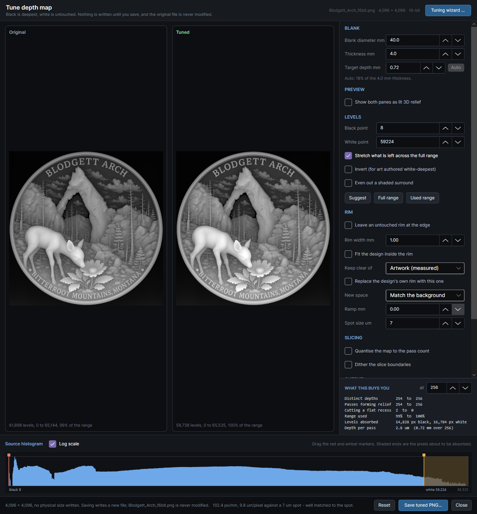</p>

Things to notice:

- **The Tuned pane looks just like the Original.** The dialog opens with *Suggest* applied:
  black at the 0.1st percentile of the whole file, white at the 99.9th - here 8 and 59,224.
  Black at 8 is the groove under the arch, so the empty stretch above it stays in the range.
- **The histogram shows the surround and the gap.** The spike at the left is the surround. The
  hump is the coin. Between the coin's deepest groove and the start of the hump is a stretch
  with almost nothing in it.
- **Every grey reaches the laser as some depth**, including the surround. A rim is not on yet.

---

## Tuning for MakeIt

The target is MakeIt 3.0.6's Relief (Emboss) mode on the Lumos Ultra with the 100 W MOPA source.

<p align="center">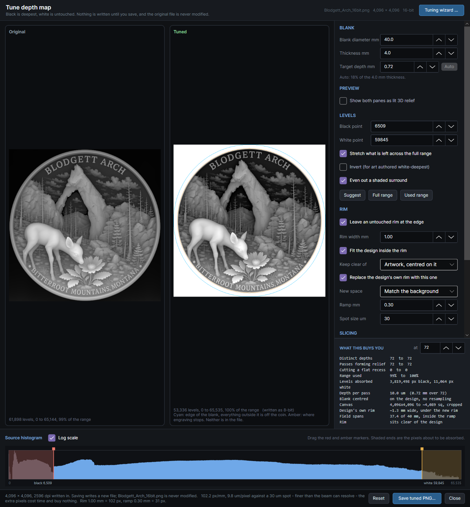</p>

### Each change, and why

**1. Even out a shaded surround.**
The surround is made one level - its most common level, about 900 - before anything else runs.
DepthView finds it by following it in from the edge of the image through levels like the
edge's own, changing gently; the coin's edge is a cliff, so it stops there. Nothing inside the
coin is touched. Without this, the shading can read as design reaching the corners of the
square, and the next two changes then shrink the coin to fit a circle round them: tried with
*Suggest*'s level points and no evening out, the blank was sized for a 6,193 px circle, no drawn
rim was found, and the coin came out about 26 mm across instead of 37. (With the black point
where change 4 puts it, above the whole surround, the level points happen to flatten the
surround too. Evening it out first means the placement does not depend on that.)

**2. Replace the design's own rim with this one, and centre the blank on it.**
DepthView finds the drawn rim (from 1,914 to 2,045 px from the coin's centre, about 1.2 mm
wide) and sizes the blank so the whole drawn rim - its inner slope, its top and its outer
bevel - lands under the new rim, which is pure white: an area the laser never goes. It is
part of the same file, so it travels into MakeIt with the design. The coin's rim is then the
blank's own polished surface, with no trench beside it. The canvas is cropped from 4,096 to
4,095 px square, and only surround is removed: DepthView counts the coin pixels a crop would
remove (none here), and refuses the crop if there are any. [More coins](#a-drawn-rim-kept-or-replaced)
shows what keeping a drawn rim does instead.

**3. Rim 1.00 mm, measured from the blank.**
Pure white, so the laser never touches it. Measure your blank's rim with calipers.

**4. Black point 6,509, from 8 - closing the empty gap.**
The groove under the arch is already the deepest thing in the coin; with the black point at
6,509 it stays at full depth. What changes is that the empty stretch from 1,442 to 6,509 no
longer takes part of the range: at 72 layers it would have been about 6 layers cutting nothing
new. Those layers go to the relief instead. 0.29% of the design becomes full depth, all of it
in that groove. The wizard finds this gap and recommends closing it:

<p align="center">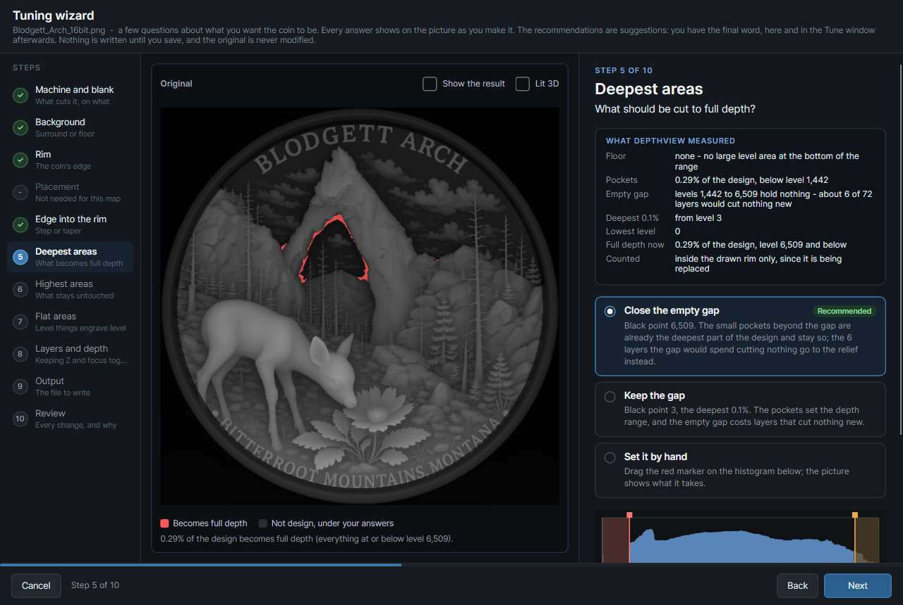</p>

**5. White point 59,845, from 59,224.**
This is the top 0.1% of the coin inside its drawn rim. *Suggest* put it lower because it
counted the drawn rim and the surround. The highest points of the relief - the fawn's back,
the flower, the lettering - become untouched surface, level with the blank's own rim.

**6. Stretch on.**
What lies between the two points is spread across the whole range, so the coin uses every
level the file can carry. This makes the relief exactly as deep as the target depth says. It
does not recover detail.

**7. Ramp 0.30 mm.**
The taper from the pure white rim down into the field, so the engraving rises to meet the rim
instead of dropping from untouched surface straight to the field in one pixel. It starts where
the drawn rim began (its *foot*), so it takes the place of that rim's inner slope. 0.30 mm is
chosen for MakeIt specifically: in every MakeIt job DepthView has read, power was sampled every
0.1 mm along a scan line, so a narrower ramp would arrive at the machine as one or two steps.

**8. Spot size 30 µm.**
This is WeCreat's published figure for the MOPA source; it has not been measured here. It only
changes the resolution note. At 102.4 px/mm this map has 9.8 µm pixels - three to a spot -
so DepthView says it is finer than the beam can resolve. That is no harm to MakeIt, which
samples every 0.1 mm anyway; it is worth knowing for LightBurn, where the line interval, not
the pixel, sets the time.

**9. Pass count 72.**
This is the layer count to set in MakeIt, and it is not arbitrary - see
[keeping Z and focus together](#keeping-z-and-focus-together). At 72 layers the target depth
works out to 10.0 µm per layer, which matches the step MakeIt's Z axis has been seen to take.
DepthView's figures at 72: 72 distinct depths, all 72 passes forming relief, none spent cutting
a flat recess and none empty. (64 layers share the 8-bit levels more evenly, at 0.64 mm deep;
the Summary explains the trade.)

**10. Output 8 bit, DPI written.**
MakeIt processes depth maps in 8 bits (WeCreat support: up to 256 layers). Writing 8 bits
yourself means the 256 levels DepthView shows are the ones MakeIt receives, rather than MakeIt
making that reduction on its own. The file is 4,095 px across 40 mm (2,600 dpi); MakeIt sizes
the image when you place it, so set it to 40 mm there.

The results card counts 3.8 million pixels absorbed to black. Almost all of them are the
evened-out surround, which is darker than the black point; it lies outside the rim and is
cropped or painted white, so none of it is engraved.

### The result

Saved as **`Blodgett_Arch_16bit-tuned-makeit.png`**, beside the original. Read back from disk
it holds all 256 levels, the coin fills the blank inside a 1 mm untouched rim with 37.4 mm of
field, and the field rises over 0.3 mm into the rim. Rendered as lit brass, with the depth
drawn 4 times deeper than it is so the relief can be seen (exaggeration 2):

<p align="center">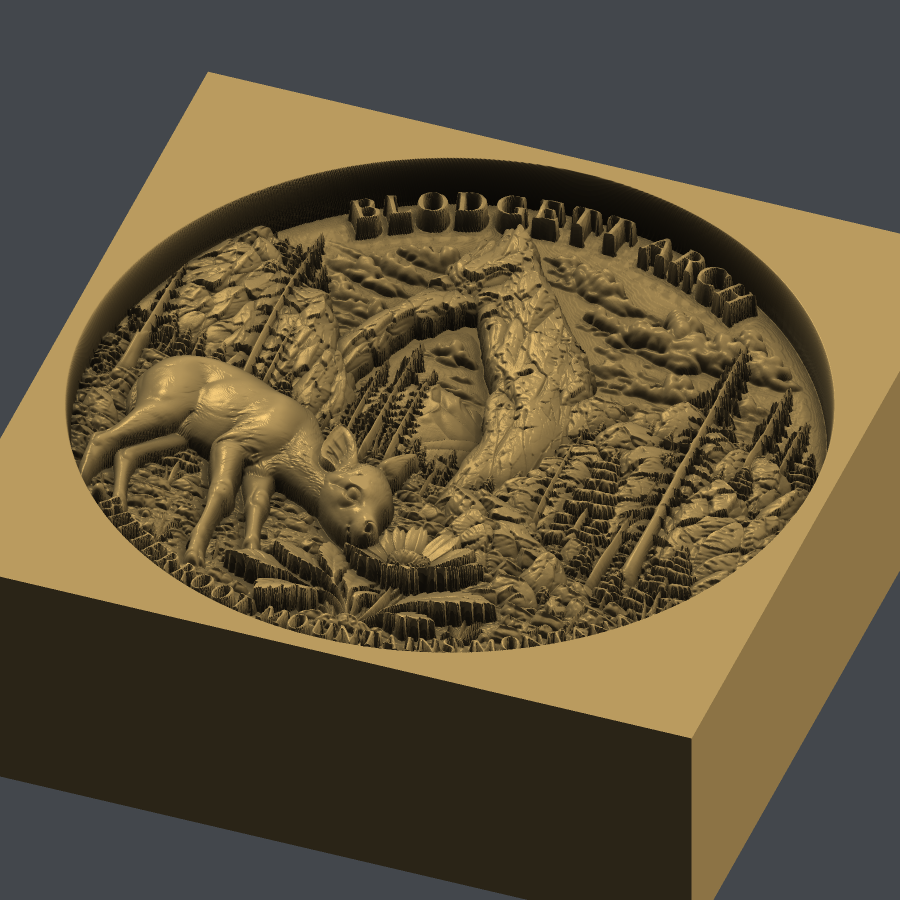</p>

The same file can be made from the command line:

```
DepthView --tune "Blodgett_Arch_16bit.png" --blank 40 --depth-mm 0.72 --rim-mm 1 --ramp-mm 0.3 \
  --cover-rim --uniform-surround --black 6509 --white 59845 --spot 30 --bits 8 --passes 72 \
  --out "Blodgett_Arch_16bit-tuned-makeit.png"
```

`--levels-from design` in place of `--black` and `--white` picks the same two points from
DepthView's own measurements, as the wizard does.

### In MakeIt

- **Layers: 72**, to match the pass count above. Keep the settings the same for every layer
  (see the Summary for why).
- **Cleaning Layer: off.** In the job checked with it on, MakeIt 3.0.6 wrote each cleaning layer
  as a copy of the engraving layer before it, at the engraving settings, and none of the cleaning
  settings appeared in the file. That is an extra engraving layer every N layers with no step in Z.
- **Check what MakeIt actually sent.** After you click *Send*, MakeIt writes the job before you
  press the button on the machine, and the file stays if you cancel. Open it in DepthView
  (`Ctrl+Shift+P` in MakeIt opens its folder) and read *Cutting heights* and *Settings*: the
  layer count, the Z step and the power, speed, frequency and pulse width should be what you set.

---

## Tuning for LightBurn

The same coin, blank and target depth, for LightBurn driving the same machine.

**Know how LightBurn sees this machine first.** LightBurn connects to the Lumos Ultra as a
G-code (GRBL-style) device, not as a galvo device. **3D Slice is a galvo-only mode**, so it is
not available here. A depth map is engraved as an Image layer in **Grayscale** mode instead:
each pixel's grey sets the laser power between the layer's Min and Max power, and depth comes
from power and from the number of passes. That changes several of the decisions below.

<p align="center"></p>

### Each change, and why

Changes 1 to 6 are the same as for MakeIt, for the same reasons: the surround evened out, the
drawn rim replaced with the blank centred on the coin, a 1.00 mm rim, black point 6,509, white
point 59,845, stretch on. What differs:

**7. Ramp 0.20 mm, not 0.30.**
LightBurn samples the image at the line interval you choose for the layer, and on this source
that can be set close to the spot. At 0.03 mm, a 0.20 mm ramp is about 6 lines, plenty for a
smooth taper. MakeIt's 0.1 mm sampling along a line is why its ramp needed to be wider. The
narrower ramp gives a little more blank to the design: 37.6 mm of field instead of 37.4.

**8. Output 16 bit, not 8.**
There is no 256-layer limit in LightBurn's path, so there is no reason to throw levels away
before it sees the file. Keeping all 16 bits means whatever reduction happens is done once, by
the program that drives the laser, and not twice. Read back, the file holds 63,618 levels.

**9. DPI written, and the alignment outline on.**
The PNG carries its true resolution (2,586 dpi, 101.8 px/mm), so LightBurn places it at exactly
40 mm when imported - no manual scaling, which is an easy way to ruin a coin. The outline is an
SVG with circles at the blank's edge and at the edge of the engraved area, plus a centre mark.
LightBurn frames an image as its rectangle, whatever is drawn in it. To line a round design up
with a round blank, put the outline on a tool layer, turn framing off for the image layer, and
frame with Hull or Contour.

**10. Pass count: 256 is only a reference here.**
DepthView's pass table models a slicer, in which each pass cuts a smaller area. Grayscale mode
does not work that way: every pass covers the whole image at a power set by each pixel. So the
table does not describe a LightBurn grayscale job. What limits depth resolution in grayscale
mode is how many distinct power levels LightBurn actually sends. Measure it: save the G-code
from LightBurn and open it in DepthView, which reports the distinct power values, the spacing of
the scan lines, and every cutting height.

### The result

Saved as **`Blodgett_Arch_16bit-tuned-lightburn.png`**, with
**`Blodgett_Arch_16bit-tuned-lightburn-outline.svg`** beside it:

<p align="center">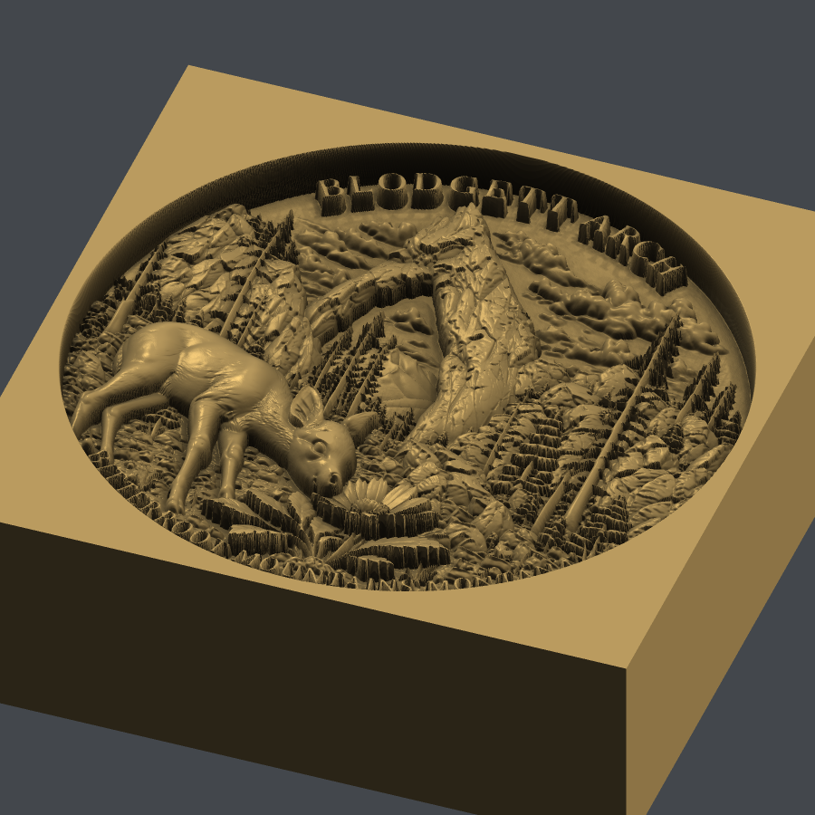</p>

```
DepthView --tune "Blodgett_Arch_16bit.png" --blank 40 --depth-mm 0.72 --rim-mm 1 --ramp-mm 0.2 \
  --cover-rim --uniform-surround --black 6509 --white 59845 --spot 30 --bits 16 --outline \
  --out "Blodgett_Arch_16bit-tuned-lightburn.png"
```

### In LightBurn

- **Import the PNG and the SVG together**, and check the image measures 40 mm.
- **Image mode: Grayscale.** Set the line interval close to the spot (0.03 mm here). Pure white
  should get no passes; check LightBurn's preview to confirm the rim and corners are not engraved.
- **Min power at the threshold, not at 0.** A metal does not ablate until the energy reaches a
  threshold, so powers below it remove nothing. With Min power at 0, the lightest greys - the
  high points of the relief - all come out at the surface, and the top of the relief flattens.
  Find the lowest power that marks your material at your speed and frequency, and use it as Min.
- **Passes and Z step together.** For a deep relief use several passes with LightBurn's Z step
  per pass (Z must be enabled for the device), set to what one pass actually removes at Max
  power. See the Summary.
- **Run a long raster test first.** Long image jobs streamed over USB from LightBurn have not
  always completed on every Lumos Ultra firmware. Make sure a job as long as this one runs to the
  end on your machine before you commit a coin to it.

---

## More coins, more outcomes

The Blodgett Arch coin raises some questions and not others. These coins show the rest, each
on the same 40 mm × 4 mm blank and 0.72 mm target, with the outcomes of a choice laid side by
side where there is one, so you can see what you are choosing between.

### A drawn rim, kept or replaced

The **First Aviation** coin has a wide raised rim drawn into the art - 1.6 mm once the blank is
sized to it - on a clean black surround. This is the wizard's rim question for it, with the
drawn rim in cyan and what replacing it does, said before it asks:

<p align="center">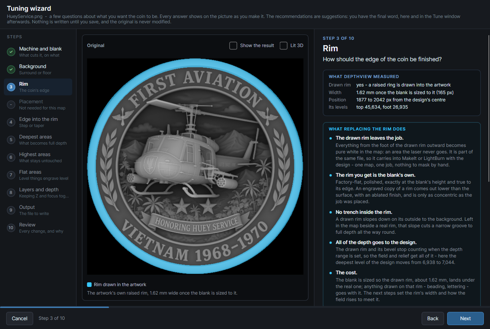</p>

The two answers, as cross-sections of the finished map near the edge of the blank (an average
round the whole coin, depth going down the page):

<p align="center">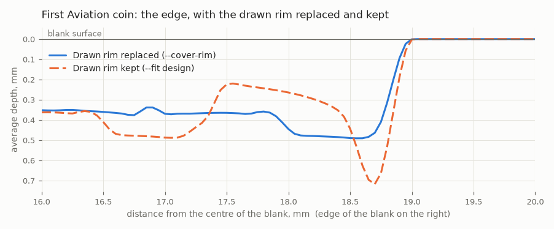</p>

- **Replaced** (solid): the field runs level to about 18.6 mm from the centre, then rises over
  the 0.3 mm taper to the blank's own rim at 19 mm. One rim, the real one, and it is untouched
  metal.
- **Kept** (dashed): the drawn rim survives as a second, lower rim inside the real one - it
  never reaches the surface, because white is reserved for the blank. Between them, where the
  drawing's outer bevel ran down to the black surround, is a trench cut to the full 0.72 mm.
  That trench, and a rim that is an engraved copy rather than the blank, are what replacing it
  avoids.

Keep a drawn rim only when it carries something you want - beading or lettering on the rim
itself - and then expect the trench.

### A black background: surround or floor

The **wolf** coin has two blacks: the surround outside its border, and the field behind the
wolf inside the border. Both are level 0, and DepthView cannot tell which one you meant to be
deep. It measures that only 12% of the area inside the coin is at that level, so it reads the
background as a surround - and asks:

<p align="center">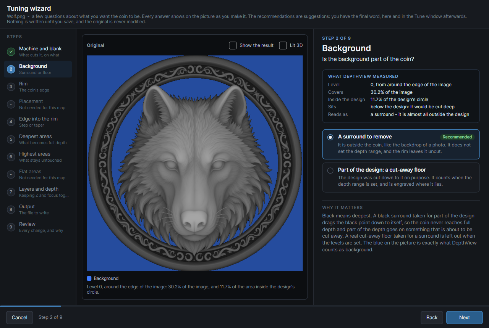</p>

Both answers cut the field behind the wolf to full depth. What they change is the wolf:

- **A surround** leaves both blacks out when the depth range is set. The black point goes to
  the wolf's own deepest level (5,319), so the wolf's deepest fur meets the field at full depth
  and the whole 0.72 mm is spread over the wolf.
- **A floor** counts the blacks. The black point stays at 0, the wolf's deepest level stops
  short of the field - about 0.06 mm above it - and the wolf is spread over slightly less depth.

<p align="center">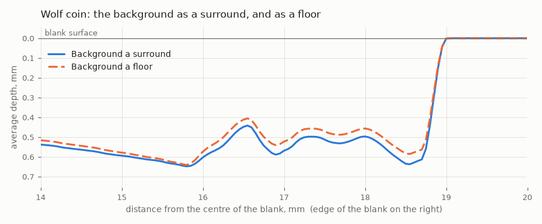</p>

On this coin the difference is small - the wolf's deepest level is only 8% of the range above
the field. On a coin whose design sits well above its background it is not, and the floor
reading is the one that keeps the design standing proud of a deep floor. Choose by what you
want the coin to look like; the wizard's recommendation is only what the measurement suggests.

### An export that needs cleaning: the FOE Eagle coin

The **FOE Eagle** coin is a different kind of file: an 8-bit RGBA image, 1,524 × 1,528 pixels,
on a white surround. Open it before tuning it:

<p align="center">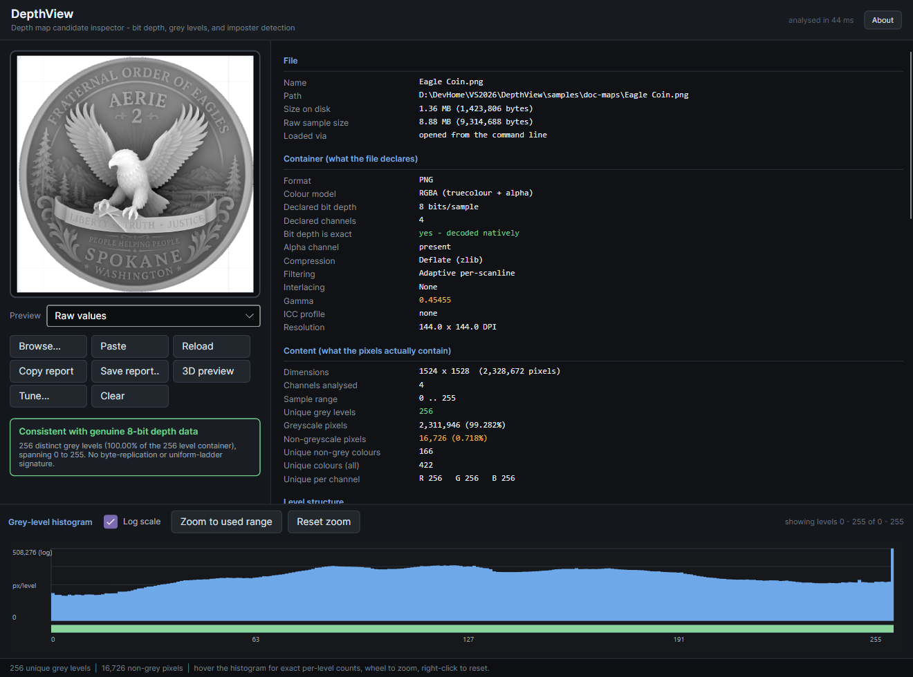</p>

- **8 bits: 256 levels.** That is enough for MakeIt, which works in 8 bits anyway - at 72
  layers each layer gets 3 or 4 levels. For LightBurn grayscale it caps the distinct powers at
  256, whatever the 16-bit output says.
- **16,726 pixels that are not grey.** Faint blue grid lines were left in the white corners
  when it was exported. They are not depth, and a depth map should not carry them.
- **26.6 µm per pixel on a 40 mm blank.** Coarser than the Blodgett map, but well matched to a
  30 µm MOPA spot: the file carries about as much detail as the beam can cut.

The grid lines would also fool the background test: they are not white, so they read as design
out at the corners - the same trap as Blodgett's shaded surround, from a different cause.
DepthView finds the coin's own edge (the furthest ring that is still mostly design) and counts
the sparse marks beyond it as surround:

<p align="center">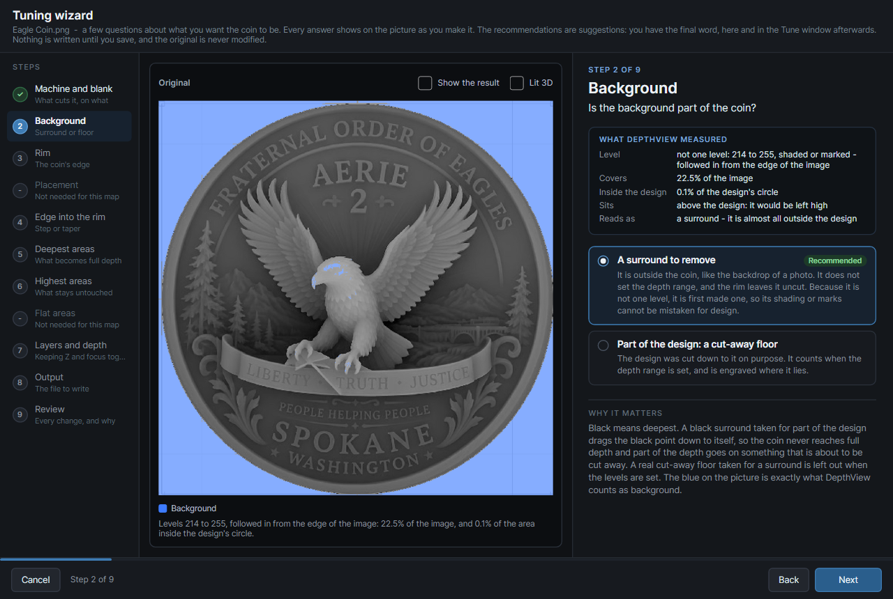</p>

Answering *a surround* evens the corners out to white with the grid lines gone, and the coin is
then placed and tuned like the others: its drawn rim (1.6 mm) replaced, black point 13, white
point 252, the coin filling 37.4 mm of the blank.

### A picture, not a depth map

Not every image of a coin is a depth map. This one, an Aerie 2 design, is a picture of a coin:
a render, lit from one side, slightly tinted. It looks like a coin because light and shadow
make it look like one - but in a depth map the grey of each pixel *is* its depth, and that is
not what these greys mean. DepthView says so before anything else:

<p align="center">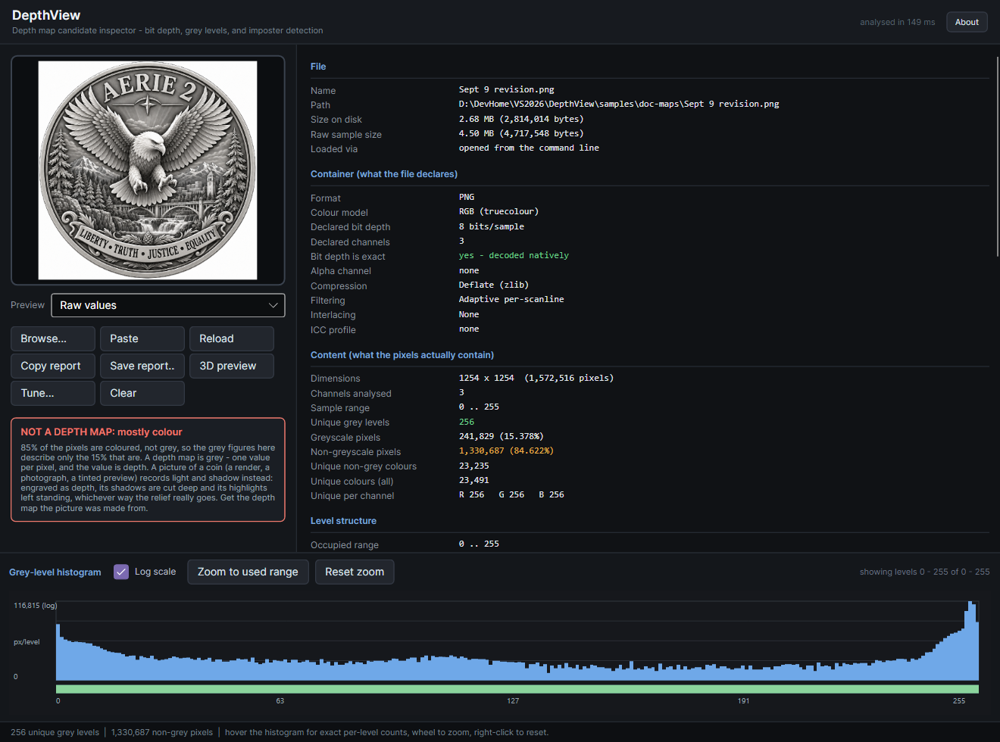</p>

85% of its pixels are coloured, not grey, so the only grey left to analyse is mostly its white
background. Engraved as if it were a depth map, every shadow is cut deep and every highlight is
left standing, whichever way the real relief goes - the far side of each feather becomes a
pit, the lettering a jumble:

<p align="center">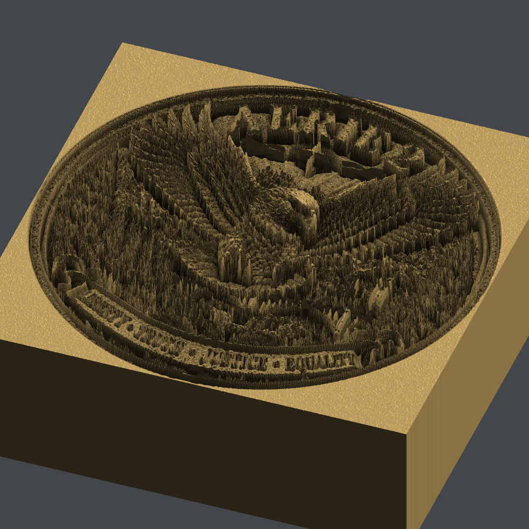</p>

No tuning repairs that; there is no depth in the file to tune. Ask for the depth map the
picture was made from - the FOE Eagle coin above is the depth map of a design like this one, and
it shows what a real one looks like. A greyscale picture can fool the colour test, so look at a
new file in DepthView's lit 3D view before you tune it: a depth map looks like a coin there, and
a picture does not.

---

## Summary

### What the coins have in common

Most of the work is about the artwork, not the software, and the same handful of questions came
up on every coin:

- **Is it a depth map?** Grey, and lit evenly in the 3D view. A picture of a coin is not one.
- **What is the surround, and is it one level?** Shading (Blodgett) and stray marks (Eagle) both
  read as design out at the corners until the surround is evened out. A black field that might
  be a floor (wolf) is your call.
- **Levels from the coin, not the file.** The surround, a drawn rim and a few stray pixels all
  pull *Suggest* away from the coin. Put the black point where the coin's own deepest greys
  begin - across any empty gap - and the white point at its own highest.
- **One rim, the real one.** If the art has its own rim, replace it, and taper from the
  untouched rim into the field. Keeping it leaves a second, lower rim and a trench (First
  Aviation).
- **The decisions are yours.** The wizard measures and recommends; you choose, and the Tune
  window lets you go further.

### Why tune differently for MakeIt and LightBurn

| | MakeIt (Relief) | LightBurn (Grayscale) |
|---|---|---|
| How depth is made | Up to 256 layers; each layer cuts a shrinking area, and power also varies pixel by pixel within a layer | Every pass covers the whole image; power follows the grey |
| Levels the software works with | 8 bits (256) | Whatever it sends - measure it from the saved G-code |
| Output bit depth | **8 bit**, so you see what MakeIt gets | **16 bit**, nothing thrown away early |
| Sampling along a line | 0.1 mm in every job read so far | The line interval you set |
| Ramp | **0.30 mm** - at least 3 samples | **0.20 mm** - several lines at a 0.03 mm interval |
| Size on the blank | Set to 40 mm in MakeIt | Placed by the DPI in the file |
| Alignment | MakeIt's own placement | The outline SVG, framed with Hull or Contour |
| Cleaning layers | **Off** - they did not work as set (below) | Not applicable |
| DepthView's pass table | A useful guide; how MakeIt combines layers with per-pixel power is not established | Not applicable - grayscale is not slicing |

Two of MakeIt's current limits shape its tuning:

- **256 layers.** MakeIt works in 8 bits, so the depth map and the layer count both top out at
  256. A 16-bit map is reduced either way; doing it in DepthView means the numbers on screen are
  the ones MakeIt uses. An 8-bit source like the FOE Eagle coin loses nothing here.
- **Cleaning passes do not work.** In the job checked with Cleaning Layer on (every 10 layers,
  33% power, 9,494 mm/s, line density 175), MakeIt 3.0.6 wrote each cleaning layer as a copy of
  the engraving layer before it, at the same height and at the engraving settings. None of the
  cleaning settings appeared anywhere in the file. So each "cleaning" layer engraves the
  previous layer again: more depth, with no change in Z. Leave it off until that changes, and
  check any job you care about with DepthView's G-code reader, which reports these repeated
  layers.

### Keeping Z and focus together

A relief is cut layer by layer, and each layer removes some material. Unless the head comes
down by the same amount each time, the focal point drifts away from the surface being cut. The
spot then grows, the energy per area falls, and each layer removes less than the last. The
error builds on itself. These are the settings that keep the two in step:

- **The same settings on every layer.** Power, speed, frequency, pulse width and line density
  all change how much a layer removes. Change any of them partway through and the removal per
  layer changes, but the Z step does not. Rotating the scan direction between layers (MakeIt's
  *Auto Planning* turns it 27° each layer) does not change the energy per area, and it helps
  keep the floor from building up ridges in one direction.
- **A Z step equal to what one layer actually removes.** Measure it rather than guess:
  DepthView's `--calibrate` coupons are made for that. In the MakeIt relief jobs DepthView has
  read, Z came down 0.01 mm per layer, even with *Z-Axis Descent* switched off, and MakeIt
  writes heights to 0.01 mm. So plan MakeIt jobs as **layers × 0.01 mm = depth**: 72 layers for
  0.72 mm. Then choose power and speed so one layer removes about 10 µm. Confirm the step in
  your own job's *Cutting heights* before you rely on it.
- **Evenly shared levels.** A slicer cuts the level range into equal bands, one per layer. If
  every band holds the same number of levels, every layer cuts the same increment and a
  constant Z step stays matched. DepthView's *band spread* column shows this; ×1.00 is even. A
  16-bit map stays close to even at any pass count. An 8-bit map is only even when the pass
  count divides its 256 levels evenly - read from the saved MakeIt file, 64 layers get exactly 4
  levels each (×1.00) and 72 get 3 or 4 (×1.33). So for MakeIt, 64 layers at 0.01 mm (0.64 mm
  deep) is the evener choice if the last 0.08 mm of depth does not matter to you. Whether
  MakeIt bands levels exactly this way is not established, so treat this as a tie-breaker, not
  a rule.
- **No extra engraving at a fixed height.** Anything that cuts again without stepping Z puts
  the surface below the focus: MakeIt's current cleaning layers, or a pass repeated by hand.
- **Line spacing no wider than the spot.** With lines further apart than the spot, the floor of
  each layer is left ridged, and the next layer starts on an uneven surface. MakeIt's line
  density is in lines per **centimetre**: 100 means 0.1 mm apart, wider than a 0.03 mm spot,
  and 334 brings it to 0.03 mm. More lines means more energy per area, so measure the removal
  per layer again after changing it.
- **Grayscale passes cannot all be in focus.** In LightBurn's grayscale mode every pass cuts
  every pixel, deep ones faster than shallow ones, so no single Z step can follow all of them.
  Set the Z step from the removal at full power, where the surface moves fastest. Keep the total
  depth modest compared with the lens's depth of focus, and check a test piece before trusting a
  deep relief.

None of this replaces a cut test. The depth a setting removes from brass or stainless on this
machine is not yet measured here; until it is, every figure above is a target to check, not a
prediction.
